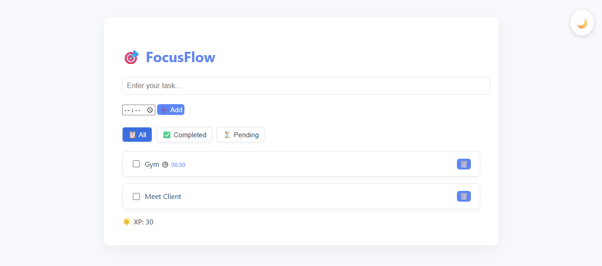
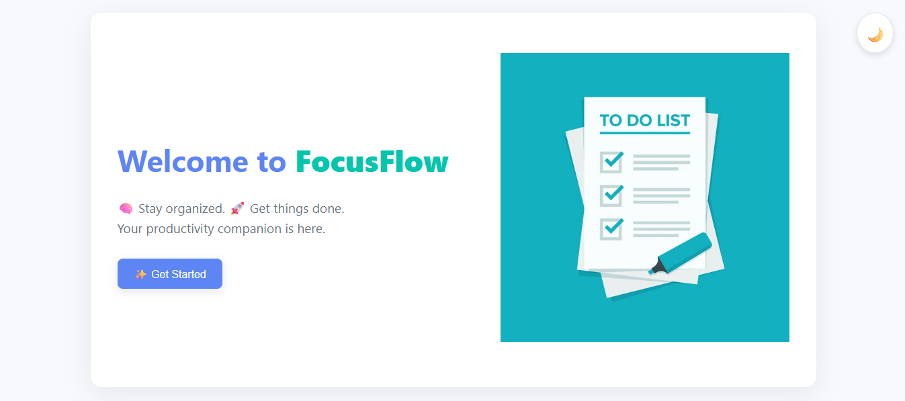
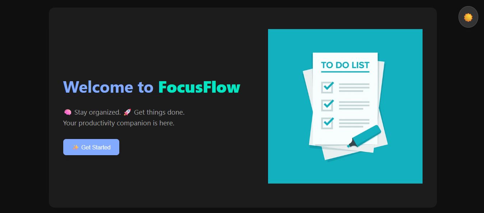
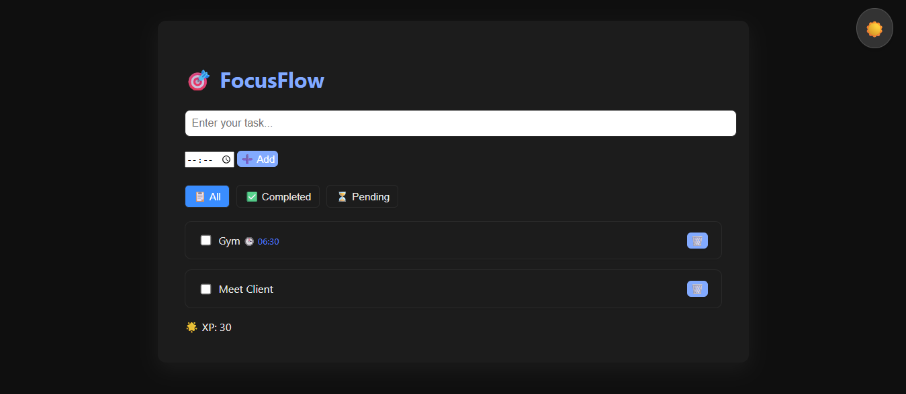

# 🎯 FocusFlow - Your Productivity Powerhouse

**FocusFlow** is a sleek, minimal, and effective task manager web app that helps you stay organized, focused, and motivated — with built-in XP rewards and reminder alerts. Whether you're a student, developer, or productivity enthusiast, FocusFlow is built for **you**.

---

## 🌟 Features

- 📝 **Add Tasks** with optional time reminders  
- ✅ **Mark as Completed** with XP reward (+10 XP)  
- 🕒 **Reminder Alerts** for tasks with set times  
- 🗂️ **Filter Tasks** by All / Completed / Pending  
- 🌗 **Dark Mode Toggle** for comfortable viewing  
- 💾 **LocalStorage Persistence** – no login needed  
- 🎮 **Gamified XP System** for motivation  
- 🎬 **Smooth fade-in animation** on page load  

---

## 🔗 Live Demo

👉 [Try FocusFlow Online](https://github.com/Venuu07/focusflow-task-manager)

---

## 🚀 Getting Started

### 1. Clone the Repository

```bash
git clone https://github.com/yourusername/focusflow-task-manager.git
cd focusflow-task-manager
2. Open tasks.html
Open it directly in your browser, or serve using VS Code Live Server, or deploy on any static host like GitHub Pages, Netlify, or Vercel.
```
📁 Folder Structure

```bash

focusflow-task-manager/
├── index.html           # (optional landing page)
├── tasks.html           # Main Task Manager App
├── style.css            # Styling file
├── script.js            # All app logic and interactivity
├── screenshots/         # UI screenshots for README
└── README.md            # This file
```
📸 Screenshots

✅ Task List Interface


🏠 Hero Page


🌗 Dark Mode




🛠️ Built With
HTML5

CSS3

Vanilla JavaScript (ES6+)

No frameworks, no libraries — just pure frontend 🔥

👤 Who is it For?
📚 Students managing study goals

🧑‍💻 Developers planning sprints

🧠 Productivity enthusiasts

💪 Anyone who enjoys gamifying their to-dos

🔮 Future Scope
🔔 Push notifications

📱 Fully responsive mobile UI

📊 XP dashboard, streak tracking

⏱️ Pomodoro mode

🙌 Contributing
Pull requests are welcome!
If you have suggestions or new features in mind, feel free to open an issue or fork this project.

💖 Acknowledgements
Made with ❤️ by Venu

Built to explore gamification, productivity, and pure frontend logic

⭐ Show Some Love
🌟 Star this repo on GitHub

🔁 Fork and customize your own version

📢 Share with others

📄 License
Licensed under the MIT License.


---

✅ You can now copy and paste this fixed markdown into your `README.md` file or upload it directly. Let me know if you want me to create a downloadable file for you too.
